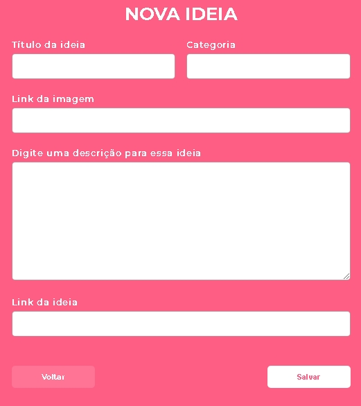

<h1 align="center">
  
</h1>

<h1 align="center">
  Sistema de cadastro de ideias para tornar a quarentena causada pelo Covid-19 mais interessante.
</h1>

<h2>
  Front-end:
</h2>

<ul>
  <li> <strong> HTML5; </strong> </li>
  <li> <strong> CSS3; </strong> </li>
  <li> <strong> JavaScript. </strong> </li>
</ul>

<h2>
  Back-end:
</h2>

<ul>
  <li> <strong> Node.js; </strong> </li>
  <li> <strong> SQLite 3. </strong> </li>
</ul>

<h2>
  Dependências:
</h2>

<ul>
  <li> <strong> Express; </strong> </li>
  <li> <strong> Nodemon; </strong> </li>
  <li> <strong> Nunjucks; </strong> </li>
  <li> <strong> Sqlite3. </strong> </li>
</ul>

---
## Para rodar a aplicação

Clone esse repositório e dentro da pasta criada e execute ```npm install```, para instalar as dependências.

Rode ```npm run dev```.

Acesse a aplicação através de **localhost:3000**.

---
## Telas

### 1 - Tela inicial


### 2 - Lista de ideias


### 3 - Criar nova ideia


---
**&copy; [Rocketseat](https://rocketseat.com.br/)**

### Licença: [MIT](LICENSE).

<hr>

<h4 align="center">
  <em>&lt;/&gt;</em> by <a href="https://github.com/Gabriel-RCastro" target="_blank">Gabriel Castro</a>
</h4>

---